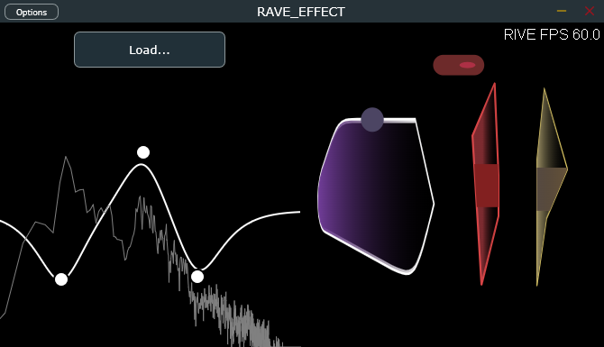

# JUCE + RAVE + RIVE 





## Build from source 

- Download and extract (https://download.pytorch.org/libtorch/cpu/libtorch-win-shared-with-deps-2.5.1%2Bcpu.zip) at the root of this repo
- Build with CMake (tested with Ninja and Clang 17 for MSVC)

## Play 

- Go to `source/frontend` and run 
```
npm install 
npm run dev
```

- Launch the program 
